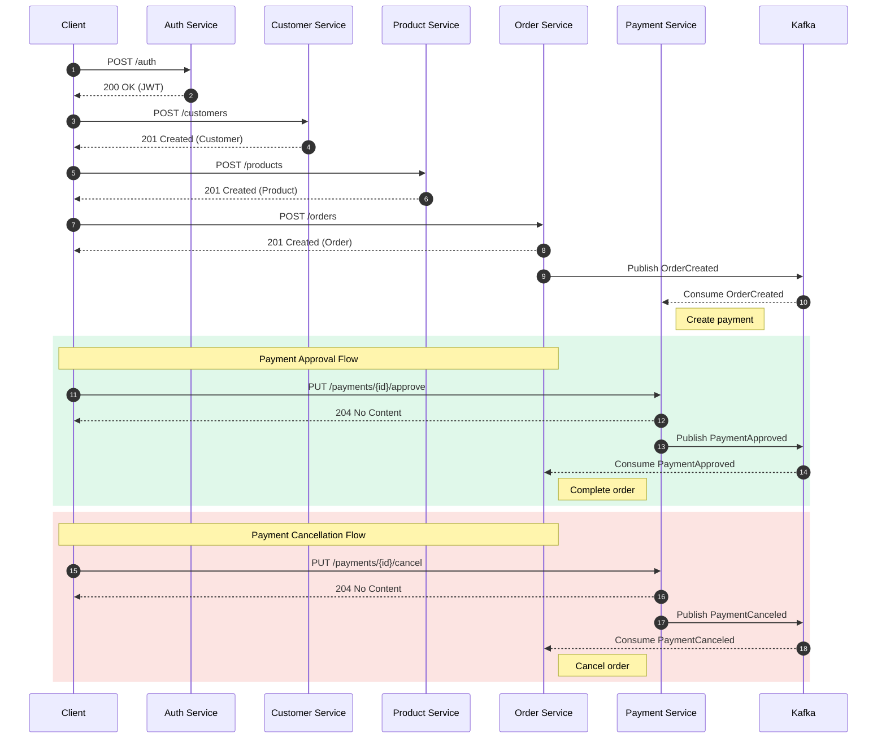

# Microservices

### The pinnacle of microservices architecture!

<br/>


## Ebooks

<table>
    <tr>
        <td>
            <a href="https://hotmart.com/product/microservices/X102617285D">
                
            </a>
        </td>
        <td>
            <a href="https://hotmart.com/pt-br/marketplace/produtos/microservices/A102616752Q">
                
            </a>
        </td>
    </tr>
</table>

## Architecture, Design and Principles

- [Screaming Architecture](https://blog.cleancoder.com/uncle-bob/2011/09/30/Screaming-Architecture.html)
- [Clean Architecture](https://blog.cleancoder.com/uncle-bob/2012/08/13/the-clean-architecture.html)
- [Event-Driven Architecture](https://martinfowler.com/articles/201701-event-driven.html)
- [Clean Code](https://www.oreilly.com/library/view/clean-code-a/9780136083238)
- [Domain-Driven Design](https://martinfowler.com/bliki/DomainDrivenDesign.html)
- [SOLID Principles](https://www.baeldung.com/solid-principles)
- [Separation of Concerns](https://blog.cleancoder.com/uncle-bob/2012/08/13/the-clean-architecture.html)
- [Common Closure Principle](https://blog.cleancoder.com/uncle-bob/2012/08/13/the-clean-architecture.html)
- [Common Reuse Principle](https://blog.cleancoder.com/uncle-bob/2012/08/13/the-clean-architecture.html)
- [Test Pyramid](https://martinfowler.com/articles/practical-test-pyramid.html)

## Patterns

- [Ambassador Pattern](https://www.geeksforgeeks.org/system-design/ambassador-pattern-in-distributed-systems)
- [Circuit Breaker Pattern](https://www.geeksforgeeks.org/circuit-breaker-vs-retry-pattern)
- [Mediator Pattern](https://refactoring.guru/design-patterns/mediator)
- [Outbox Pattern](https://www.geeksforgeeks.org/outbox-pattern-for-reliable-messaging-system-design)
- [Result Pattern](https://www.codingexplorations.com/blog/mastering-the-result-pattern-in-software-development)
- [Retry Pattern](https://www.geeksforgeeks.org/circuit-breaker-vs-retry-pattern)
- [Strategy Pattern](https://refactoring.guru/design-patterns/strategy)

## Technologies and Tools

- [Java](https://www.oracle.com/java)
- [Spring Boot](https://spring.io/projects/spring-boot)
- [Kong](https://konghq.com)
- [Keycloak](https://www.keycloak.org)
- [OAuth2](https://oauth.net/2)
- [JWT](https://jwt.io)
- [Kafka](https://kafka.apache.org)
- [MongoDB](https://www.mongodb.com)
- [Debezium](https://debezium.io)
- [Redis](https://redis.io)
- [Elastic](https://www.elastic.co)
- [Swagger](https://swagger.io)
- [Testcontainers](https://testcontainers.com)
- [Docker](https://www.docker.com)
- [Kubernetes](https://kubernetes.io)

## Run

- **Full** (Run all infrastructure, dependencies, and services)

    `docker compose --profile full up --detach --build --remove-orphans`

- **Dev** (Run only required infrastructure, dependencies, and services)

    - **Windows:** `run.ps1`

    - **Linux:** `bash run.sh` or (`chmod +x run.sh` and `./run.sh`)

## Tools

- **Kong:** `http://localhost:8002`

- **Keycloak:** `http://localhost:8005` **Username:** `admin` **Password:** `password`

- **Kafka:** `http://localhost:9000`

- **Mongo:** `http://localhost:27018`

- **Redis:** `http://localhost:6380`

- **Logs:** `http://localhost:5601/app/management/data/index_management/data_streams`

- **APM:** `http://localhost:5601/app/apm/services`

## Flow



## Services

### AuthService

**Localhost:** `http://localhost:8010`

**Docker:** `http://localhost:9010`

**Kong:** `http://localhost:8000/authservice`

| Method                                             | Endpoint    | Description |
|:--------------------------------------------------:|-------------|-------------|
|      | /auth       | Get         |
|     | /auth       | Auth        |
|     | /users      | Save        |
|  | /users/{id} | Delete      |

### ConfigurationService

**Localhost:** `http://localhost:8015`

**Docker:** `http://localhost:9015`

**Kong:** `http://localhost:8000/configurationservice`

| Method                                              | Endpoint                           | Description   |
|:---------------------------------------------------:|------------------------------------|---------------|
|       | /configurations                    | List          |
|       | /configurations/{id}               | Get           |
|      | /configurations                    | Create        |
|      | /configurations/{id}               | Update        |
|  | /configurations/{id}/value/{value} | Update Value  |
|   | /configurations/{id}               | Delete        |

### CustomerService

**Localhost:** `http://localhost:8020`

**Docker:** `http://localhost:9020`

**Kong:** `http://localhost:8000/customerservice`

| Method                                             | Endpoint        | Description |
|:--------------------------------------------------:|-----------------|-------------|
|      | /customers      | List        |
|      | /customers/{id} | Get         |
|     | /customers      | Create      |
|     | /customers/{id} | Update      |
|  | /customers/{id} | Delete      |

### ProductService

**Localhost:** `http://localhost:8025`

**Docker:** `http://localhost:9025`

**Kong:** `http://localhost:8000/productservice`

| Method                                             | Endpoint       | Description |
|:--------------------------------------------------:|----------------|-------------|
|      | /products      | List        |
|      | /products/{id} | Get         |
|     | /products      | Create      |
|     | /products/{id} | Update      |
|  | /products/{id} | Delete      |

### OrderService

**Localhost:** `http://localhost:8030`

**Docker:** `http://localhost:9030`

**Kong:** `http://localhost:8000/orderservice`

| Method                                          | Endpoint     | Description |
|:-----------------------------------------------:|--------------|-------------|
|   | /orders      | List        |
|   | /orders/{id} | Get         |
|  | /orders      | Create      |

### PaymentService

**Localhost:** `http://localhost:8035`

**Docker:** `http://localhost:9035`

**Kong:** `http://localhost:8000/paymentservice`

| Method                                              | Endpoint                                  | Description     |
|-----------------------------------------------------|-------------------------------------------|-----------------|
|       | /payments                                 | List            |
|       | /payments/{id}                            | Get             |
|       | /payments/order/{orderId}                 | Get By Order Id |
|  | /payments/{id}/approve                    | Approve         |
|  | /payments/{id}/cancel                     | Cancel          |

## Examples

- ### [Images](https://github.com/rafaelfgx/Microservices/blob/main/.images/readme.md)

- ### Cache

    ```java
    @RequiredArgsConstructor
    @Service
    public class ProductCacheService {
        private static final String ITEM_CACHE = "product";
        private static final String LIST_CACHE = "product-list";
        private final ProductRepository repository;

        @Cacheable(cacheNames = LIST_CACHE, sync = true)
        public List<Product> get() {
            return repository.findAll();
        }

        @Cacheable(cacheNames = ITEM_CACHE, key = "#id", sync = true)
        public Optional<Product> get(final UUID id) {
            return repository.findById(id);
        }

        @Caching(
            put = @CachePut(cacheNames = ITEM_CACHE, key = "#result.id"),
            evict = @CacheEvict(cacheNames = LIST_CACHE, allEntries = true)
        )
        public Product save(final Product product) {
            return repository.save(product);
        }

        @Caching(evict = {
            @CacheEvict(cacheNames = ITEM_CACHE, key = "#id"),
            @CacheEvict(cacheNames = LIST_CACHE, allEntries = true)
        })
        public void delete(final UUID id) {
            repository.deleteById(id);
        }

        @Caching(evict = {
            @CacheEvict(cacheNames = ITEM_CACHE, allEntries = true),
            @CacheEvict(cacheNames = LIST_CACHE, allEntries = true)
        })
        public void delete() {
            repository.deleteAll();
        }
    }
    ```
